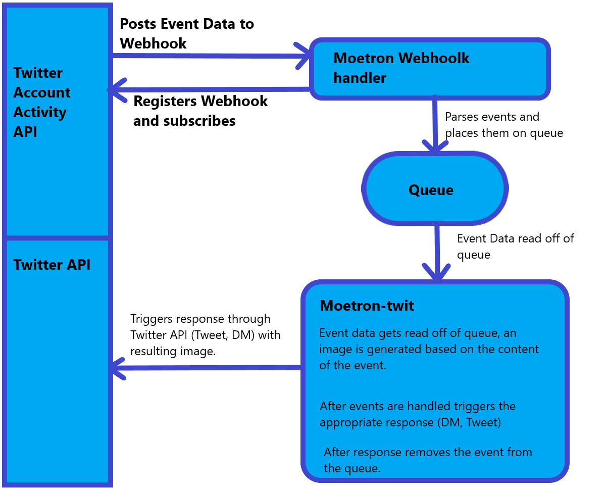

## Twitter Bot using StyleGAN2 to generate anime face images.

This is a twitter bot that interfaces with the StyleGAN2 generator to create images.

## Commands:

Currently there's only 3 commands supported, a lot less than the discord version of moetron.
In the future I'll probably add more. Also, I'll eventually add image examples of the commands.

**rand / random** 
Generates an image from a random seed.

Ex: @MoetronBot moerand

**mess / messy** 
Generates an image from a random seed w/ truncation turned off so you may get wild results.

Ex: @MoetronBot moemess

**name** 
Generates an image based on the hash of a string.

Ex: @MoetronBot moename hey give me an anime girl
(above will hash "hey give me an anime girl" and use that for the seed.)

## Setup:

To get this working follow the steps on the official StyleGAN2 repo:
https://github.com/NVlabs/stylegan2

It's kind of a pain to set up everything... Honestly I'd just try to get StyleGAN2 running first on your machine, then you'll know that this will work. After you get it working, you need to set up a twitter dev account and get all of your keys and whatnot. Set them as ENV variables (look in util/config.py)

Off the top of my head the requirements for windows are:
* Python 3.7 (3.8 or newer won't work)
* CUDA 10.0
* cuDNN 7.5 or newer
* Visual Studio 2017 w/ MSVC

You can install python reqs using `pip install -r requirements.txt`

You can test CUDA by running test_nvcc.cu

Currently the bot's key is set to be read from an env var. You can just hardcode it though if you want.

After everything is setup run the bot using `python bot.py` It'll take a few seconds to start up because it starts up tensorflow and generates a couple images before the bot starts.

For linting, I use the following settings:

"python.linting.pylintArgs": [
    "--extension-pkg-whitelist=numpy",
    "--errors-only"
]

The model I used can be obtained from:
https://www.gwern.net/Faces#stylegan-2
you can use whatever model you want, but this bot was built around using this one. Hence the "moe" naming and such.

All credits for the trained model goes to the original creator Aaron Gokaslan.

This bot is not used for commercial purposes, and derivatives of this work should not be used for commercial purposes. See the license for more information.

See the license under docs, it's the same as the stylegan2 license.
https://nvlabs.github.io/stylegan2/license.html

**Alternatively**
You can use the provided dockerfile if you have either a linux host or dev channel windows build w/ wsl2 set up. Idk if it works I haven't tested it because windows refuses to let me use the dev insider build for some reason.

**Model / Network changing:**
To change the model that the bot uses simply pass in the path to the network when creating the Generator.

## Other:

### Moetron Architecture:

Here's a simple architecture diagram made in paint. The architecture is pretty simple but more complex than just writing a standalone bot like you can for discord.

There's 3 main parts in play here.

**Webhook handler**
A simple webapp that does a few things. First, it registers the webhook and subscribes to the user's events. Next, it handles events that are posted to it from Twitter. Since we only want tweet events and dm events it ignores all others. It'll check the events and make sure that they're actually commands (ie: contain the keywords for one of the commands that moetron-twit supports) and if they're valid it'll take out the relevant data from the event and place it on the queue. It also handles the CRC check from twitter which gets triggered hourly.

**Queue**
A queue that holds events placed on it by the webhook handler. It holds events until they're read by Moetron, so if moetron has downtime they'll still eventually get read and responded to.

**Moetron**
The gut of the bot that reads the parsed events off of the queue. Based on the text content of the event it'll generate an image for the specific command. Checks whether the event is a DM or tweet and triggers the appropriate response using tweepy. After the response is triggered, it'll remove the event off of the queue.

### Questions

Q) I see a lot of errors / warnings on startup, does that matter?

A) Probably not, tensorflow will probably give some deprecation warnings and on startup you may see some memory allocation warnings. You can ignore them. If the bot starts up you should be good to go, just give it a couple seconds.

Q) I want to make a similar Twitter bot that generates images, do I need to set up a webhook handler as well?

A) You don't *have to* but streaming doesn't support DMs and non-direct replies (Mentions from replies in other user's tweets) I believe so you can make a bot using just streaming but it'll have limited functionality. You could combine the webhook handler and the bot into one, but you'd have to publically expose the webhook endpoints on the bot.

For other questions raise a question issue and I'll try to respond when I can.

**Acknowledgement:**
* Aaron Gokaslan for the pre-trained model
* Gwern Branwen for all of their articles about StyleGAN.
* The creators of StyleGAN2, dnnlib is from there w/ all copyrights / attributions remaining.

**Future work**
* Probably try to increase performance. Since the GPU is the bottleneck anyways I'm not entirely sure what I can do to speed things up.
